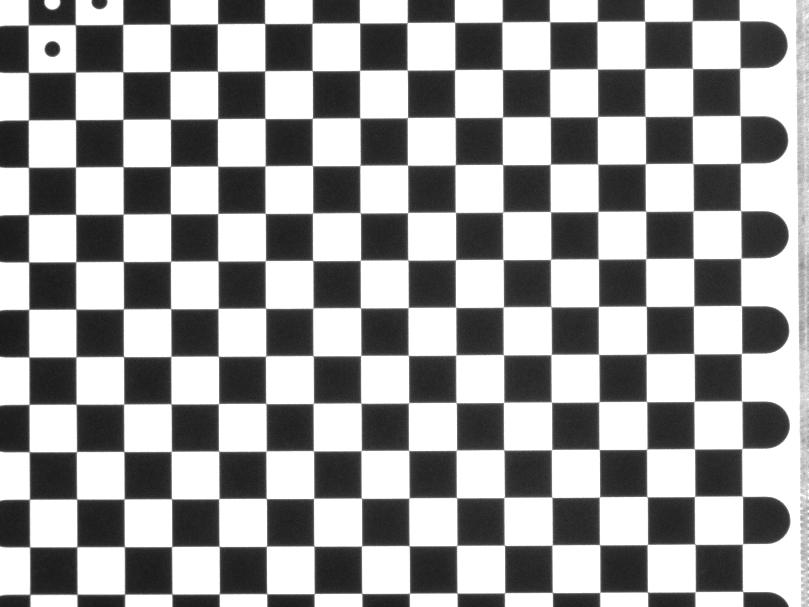
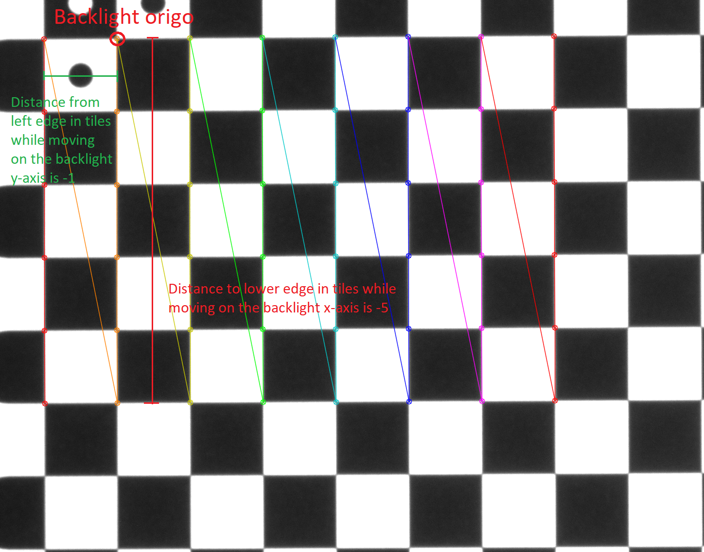
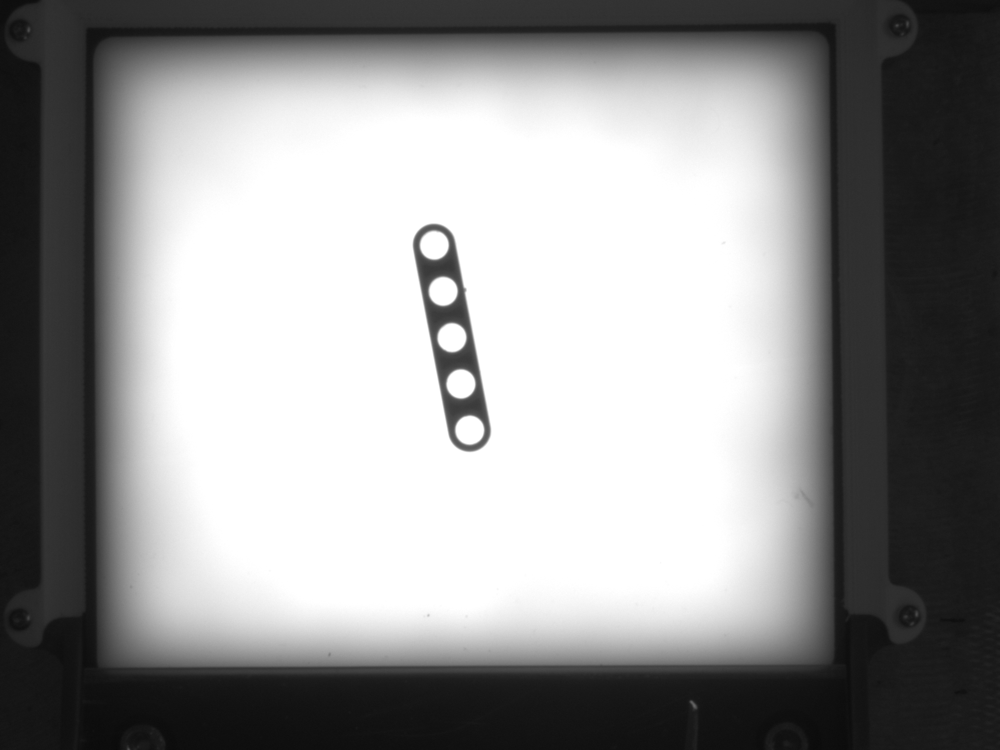
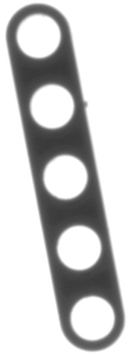
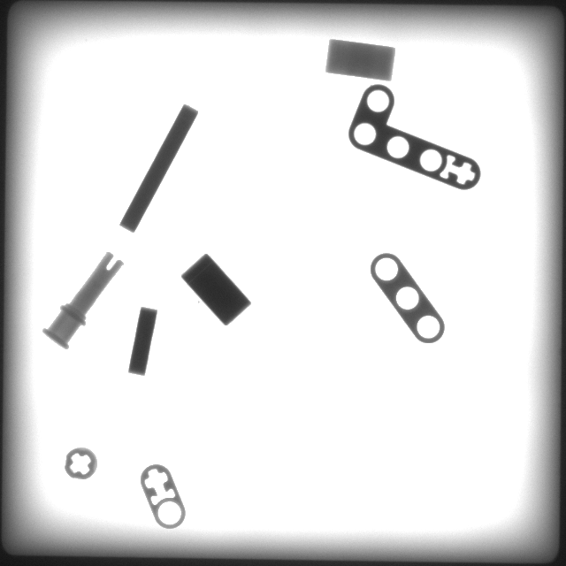

# LEGO_sorter
Python project used to run with an EPSON SCARA robot work cell for LEGO part sorting. Relies on Yolov5 and OpenCV for LEGO part identification and localization.

## How to run

These instructions work if the robot work cell setup has not changed. If the setup has changed check the [calibration](#calibration) section.

1. Clone this repository and submodules

2. Pip install the [requirements](./requirements.txt)

     NOTE: $pip install torch installs different version depending on the used platform,we recommend installing torch version that supports CUDA 11.3 or newer. To do this we recommend visiting https://pytorch.org/ and determining right pip install command following instructions stated there.

3. Turn on the LED backlight and make sure there are no parts on it.

4. Run the [Communicate_to_robot.py](./Communicate_to_robot.py) script

5. Wait for the script to print out:
     ```
     "#########################"
          "Starting server"    
     "#########################"
     ```
6. Start the robot program.

Pressing ctrl+C once to close connection to robot and the program starts to wait for a new connection. Pressing ctrl+C twice closes the program.


## Calibration

If the work cell setup has changed or the camera has moved then re-calibration is recommended. To re-calibrate the camera follow these steps:

1. Take a calibration picture with the camera and save it as [calibration_image.png](./train/calibration_image.png) to the train folder

     

2. Run the [camera_calibration.py](./train/camera_calibration.py) script. The script should show a picture with a detected chessboard like this:

     

3. If the image is not shown then OpenCV has failed to detect the chessboard. To help the detection lighting conditions can be tuned and the calibration can then be retried. If this does not help then the number of rows and columns that are tried to detect can be reduced in the file [camera_calibration.py](./train/camera_calibration.py). If that does not provide good results then researching OpenCV camera calibration and modifying the [camera_calibration.py](./train/camera_calibration.py) is recommended.

4. Check the disctance in chessboard tiles from the detected areas lower edge and left edge to the backlight origo moving on the x and y axis respectively. Here is an example picture for measuring the distance:

     

     The three dots in the chessboards corner define the backlight origo. In the image distance from lower edge is -5 and distance from left edge is -1.

5. Modify calibration_x_offset and calibration_y_offset in [calibrator.py](./src/calibrator.py) according to the measured tiles.

## Training

The current detection network model is trained to detect 78 different LEGO parts that were available at the laboratory during the project implementation. There might be need to add new parts and for that a new model needs to be trained. Here are steps needed to train new LEGO detection network.

1.	Clone this repository and its submodules.

2.	Take images from the new LEGO parts with the work cells camera. There should be one image of every different LEGO part from different sides and for different colors. These will be the classes that will be trained to the detector. The image file names should start with the color code character (for example: g, b, r, y) then the class identifier (for example: 2, 7, 21, 90) and then an underscore _ and the orientation id (a, b, c, d or u). The orientation index ‘u’ should be used for orientations that can easily be misinterpreted as other LEGO parts. Here is an example image: g4_a.png

     

3.	Save the new images to the repository’s train/orig_images folder

4.	Use the CVAT-tool (https://github.com/openvinotoolkit/cvat) or some other tool like it to create Yolo style annotation text files for the new images. Each annotation text file should include bounding box information to the corresponding LEGO part image in format: label, x_center. y_center, width, height where the measures are in normalazed format ([0,1]). The file names should match (g2_b.png and g2_b.txt). 

5.	Save the annotation text files to the repository’s train/obj_train_data folder

6.	Run the create_templates.py script. Here is an example of what it should produce:

     

7.	Add the old templates from already known parts to repository’s train/templates folder

8. Add the new class names to the class name lists of [create_images.py](./train/create_images.py) and [legoset.yaml](./train/legoset.yaml). The color code characters should not be included in the class name lists and only one entry is enough for all colors. The new class names should be in the same format as the ones already in the list.

9.	Run the [create_images.py](./train/create_images.py) script twice to create training and validation images. Read the scripts comments and make needed changes between runs to achieve this. Here is an example image created (images can be found under the train/dataset/train and val folders):

     

10.	After this the training process should be done on machine with a decent NVIDIA GPU and NVIDIA cuda support. The training process is started by running the Yolov5 project’s training script. The Yolov5 repo is already downloaded as a submodule of the LEGO_sorter repository and the training script should be found from models/yolov5/train.py. The training should start by running the training script from the yolo folder:
     ```
     $ cd models/yolov5
     $ python train.py --img 640 --batch 1 --epochs 35 --data ../../train/legoset.yaml   --weights yolov5m.pt
     ```
     If there are problems with the training consult the instructions in
     https://github.com/ultralytics/yolov5/wiki/Train-Custom-Data 

11.	After the training is finished the new model checkpoint should be in yolov5/runs/train/exp/weights/best.pt. The checkpoint should be renamed and moved to the models/checkpoints folder.

12.	Take the new model to use by setting the CHECKPOINT_NAME variable of Communicate_to_robot.py script to the name of the new model checkpoint.
